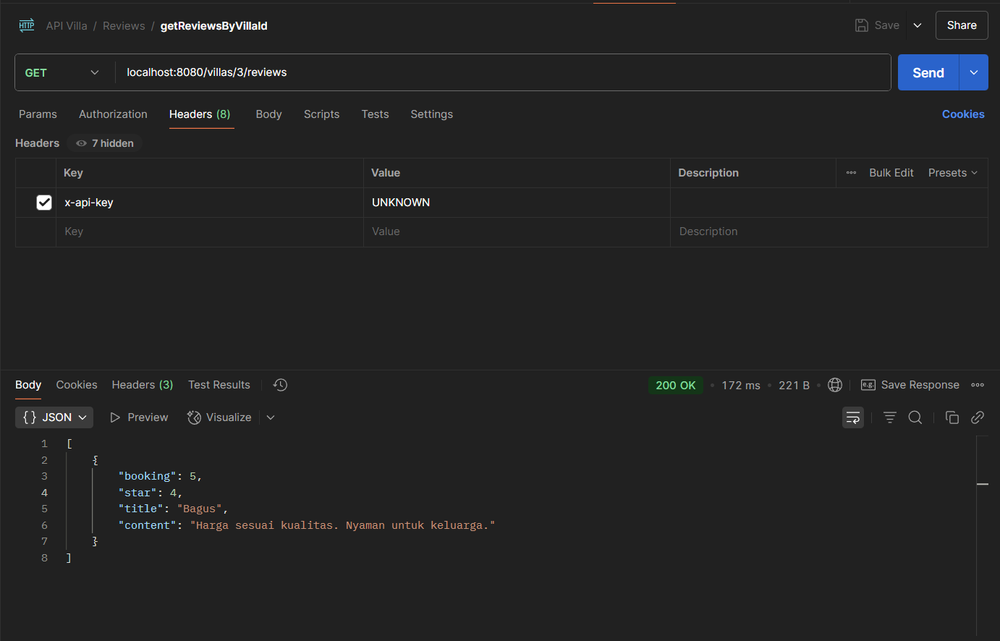
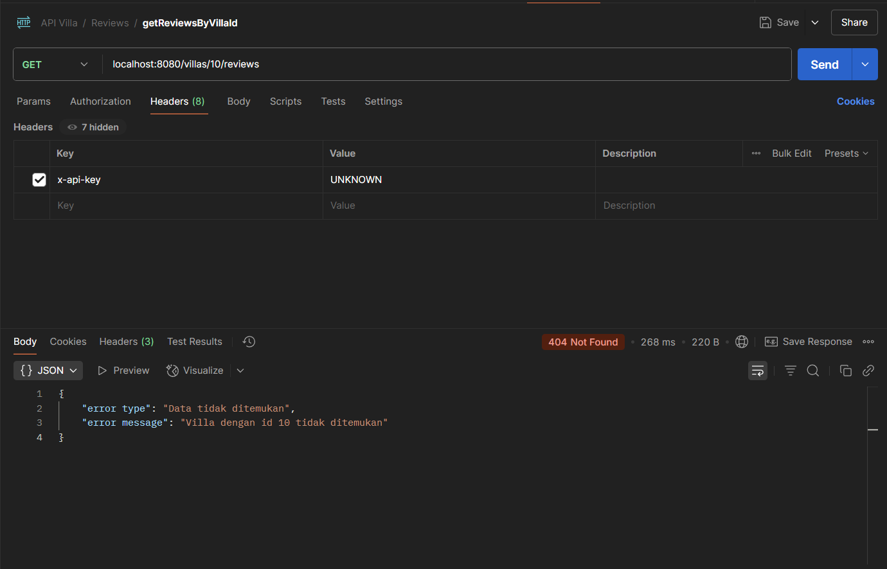
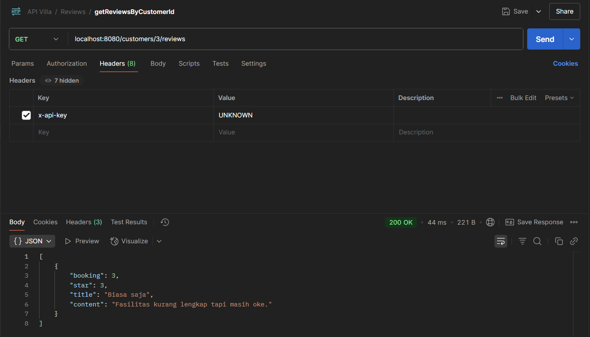
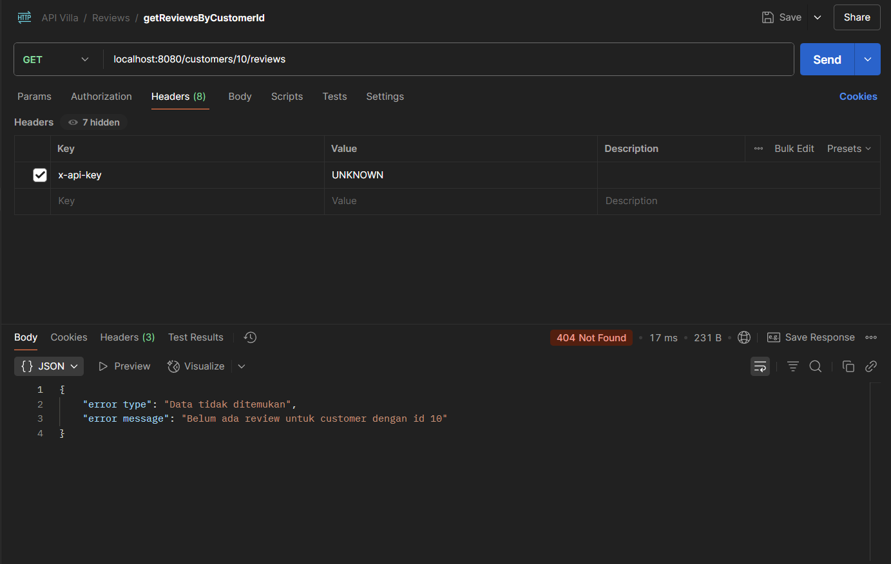
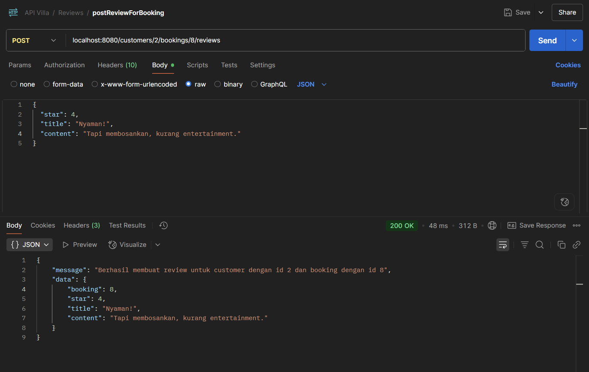
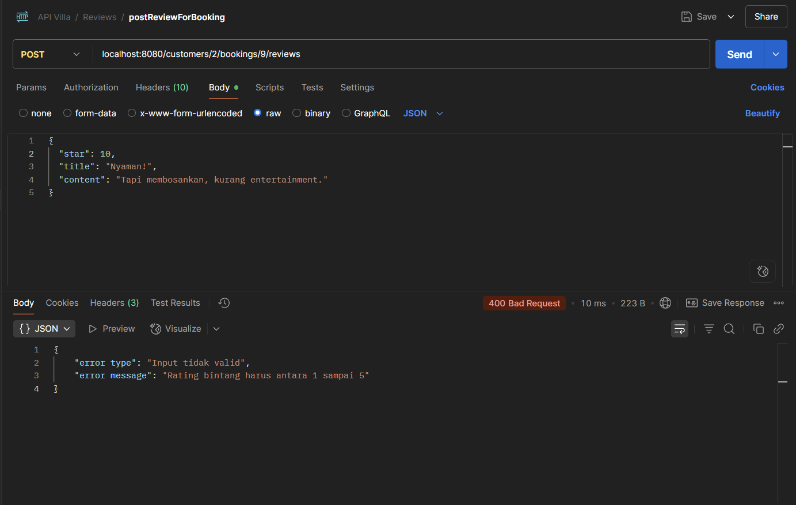

# 🏡 API JAVA OOP | Aplikasi Pemesanan Vila

---

## 👥 Identitas Kami

| Nama                         | NIM         | Kelas |
|------------------------------|-------------|-------|
| I Putu Raditya Dharma Yoga   | 2405551026  | PBO D |
| Gerald Hizkia Turnip         | 2405551081  | PBO D |
| Elika Putri Wicaksana        | 2405551093  | PBO D |
| Mahaprama Danesh Hiswara     | 2405551094  | PBO D |

---

## 📌 Introducing

Ini adalah **backend API** sederhana berbasis **Java (tanpa Spring Boot)** yang dibuat untuk memenuhi tugas mata kuliah **Pemrograman Berorientasi Objek (PBO)**. Aplikasi ini mensimulasikan proses pemesanan vila dengan fitur CRUD untuk entitas:

- Customer
- Villa
- Room Type
- Booking
- Review
- Voucher

Data disimpan dalam **SQLite**, dan API dapat diuji menggunakan aplikasi seperti **Postman** melalui alamat: http://localhost:8080

---

## Dokumentasi API

## 📝 Review

Review adalah fitur yang memungkinkan pelanggan untuk memberikan penilaian dan umpan balik setelah melakukan pemesanan vila. Setiap review berisi informasi mengenai:

- **Booking ID**: Referensi pemesanan yang diulas
- **Bintang (star)**: Penilaian antara 1–5
- **Judul (title)**: Ringkasan kesan pelanggan
- **Isi (content)**: Ulasan lengkap tentang pengalaman pelanggan

> ⚠️ **Fitur review hanya dapat digunakan jika entitas `Customer`, `Villa & Room Type`, dan `Booking` sudah terisi dengan benar.**

Berikut adalah daftar endpoint yang tersedia untuk entitas `Review`.

---

### 🔍 GET `/villas/{id}/reviews`

Mengambil semua review yang diberikan untuk **satu vila** berdasarkan ID vila.

### ✅ 1. Review Berhasil Ditemukan

Berhasil menampilkan semua review untuk villa dengan ID tertentu.

**Contoh Response:**




### ❌ 2. Gagal - Villa Tidak Ditemukan

Jika ID villa pada path tidak ada di database, maka sistem akan memberikan pesan error seperti berikut:

**Contoh Response:**



---

### 🔍 GET `/customers/{id}/reviews`

Mengambil semua review yang pernah ditulis oleh satu customer berdasarkan ID customer.

### ✅ 1. Review Berhasil Ditemukan

Mengambil semua review yang pernah ditulis oleh satu customer berdasarkan ID customer.

**Contoh Response:**



### ❌ 2. Gagal – Customer Tidak Ditemukan atau Belum Menulis Review

Jika ID customer tidak ditemukan di database, atau belum pernah menulis review, maka sistem akan memberikan pesan error seperti berikut:

**Contoh Response:**



---

### 📝 POST `/customers/{customerId}/bookings/{bookingId}/reviews`
Menambahkan review baru dari seorang customer untuk booking tertentu. Endpoint ini hanya bisa digunakan jika customer dan booking tersebut sudah ada di database, dan booking memang milik customer tersebut.

Gunakan format berikut saat menambahkan review:

```json 
{
  "star": 5, 
  "title": "Judul Review",
  "content": "Isi dari Review"
}
```

### ✅ 1. Review Berhasil Ditambahkan

Berhasil menambahkan review untuk booking milik customer dengan ID tertentu.

**Contoh Request:**



### ❌ 2. Gagal – Booking Tidak Ditemukan atau Bukan Milik Customer

Jika booking tidak ditemukan atau tidak dimiliki oleh customer dengan ID yang sesuai, sistem akan memberikan pesan kesalahan seperti:

**Contoh Request:**


### ❌ 3. Gagal – Validasi Review
Jika nilai yang dikirim tidak valid (misal star < 1 atau > 5 atau title kosong), maka sistem akan menolak data.

**Contoh Response:**



---
