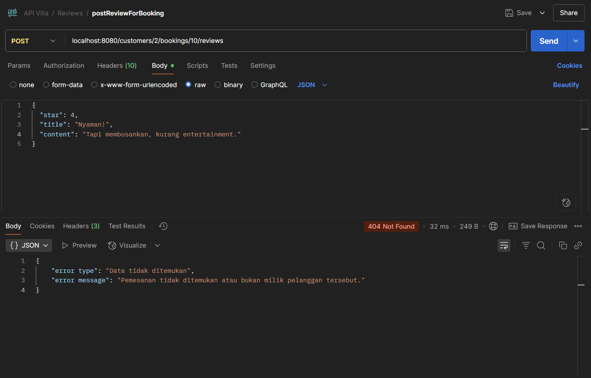

# 🏡 API JAVA OOP | Aplikasi Pemesanan Vila

---

## 👥 Identitas Kami

| Nama                         | NIM         | Kelas |
|------------------------------|-------------|-------|
| I Putu Raditya Dharma Yoga   | 2405551026  | PBO D |
| Gerald Hizkia Turnip         | 2405551081  | PBO D |
| Elika Putri Wicaksana        | 2405551093  | PBO D |
| Mahaprama Danesh Hiswara     | 2405551094  | PBO D |

---

## 📌 Introducing

Ini adalah **backend API** sederhana berbasis **Java (tanpa Spring Boot)** yang dibuat untuk memenuhi tugas mata kuliah **Pemrograman Berorientasi Objek (PBO)**. Aplikasi ini mensimulasikan proses pemesanan vila dengan fitur CRUD untuk entitas:

- Customer
- Villa
- Room Type
- Booking
- Review
- Voucher

Data disimpan dalam **SQLite**, dan API dapat diuji menggunakan aplikasi seperti **Postman** melalui alamat: http://localhost:8080

---

## Dokumentasi API
## 👤 Customer
Customer merepresentasikan pengguna yang melakukan pemesanan vila. Customer dapat memiliki beberapa pemesanan (booking) dan memberikan review. Setiap vila berisi informasi mengenai:

| Field | Tipe Data dalam Database | Tipe Data dalam Program | Keterangan                                 |
|-------|--------------------------|-------------------------|--------------------------------------------|
| id    | `INT`                    | `Integer`               | Identitas unik dari masing-masing customer |
| name  | `TEXT`                   | `String`                | Nama lengkap customer                      |
| email | `TEXT`                   | `String`                | Alamat email customer                      |
| phone | `TEXT`                   | `String`                | Nomor telepon customer                     |

Berikut adalah daftar endpoint yang tersedia untuk entitas `Customer`

___

### 🔍 GET `/customers`

Menampilkan seluruh customer yang terdaftar.

### ✅ 1. Berhasil Menampilkan Seluruh Customer

Berhasil menampilkan seluruh customer yang terdaftar.

**Contoh Response:**


### ❌ 2. Gagal - Tidak Ada Customer Pada Database

Kondisi ini terjadi jika tidak terdapat data customer sama sekali dalam database.

**Contoh Response:**


---

### 🔍 GET `/customers/{id}`

Menampilkan informasi detail customer berdasarkan id.

### ✅ 1. Berhasil Menampilkan Data Customer

Berhasil menampilkan informasi detail customer berdasarkan id.

**Contoh Response:**


### ❌ 2. Gagal - ID Customer Tidak Ditemukan

Kondisi ini terjadi jika tidak terdapat Customer dengan id yang sesuai.

**Contoh Response:**


---
### 📝 POST `/customers`

Menambahkan customer baru. Email dan nomor telepon akan divalidasi untuk format yang benar.

Gunakan format berikut untuk menambahkan customer:
```json 
{
  "name": "Maru",
  "email": "maru@example.com",
  "phone": "+6281234567890"
}
```

### ✅ 1. Berhasil Menambahkan Customer

Berhasil menambahkan data customer baru.

**Contoh Response:**


### ❌ 2. Gagal - Gagal Menambahkan Customer

Kondisi ini terjadi jika ada field yang kosong atau format email atau nomor telepon tidak sesuai.

**Contoh Response:**


---

### ✏️ PUT `/customers/{id}`

Memperbarui data customer yang sudah ada berdasarkan id.

### ✅ 1. Berhasil Memperbarui Data Customer

Berhasil memperbarui data customer berdasarkan id.

**Contoh Response:**


### ❌ 2. Gagal - ID Customer Tidak Ditemukan

Kondisi ini terjadi jika tidak terdapat data customer dengan id yang sesuai.

**Contoh Response:**

---

## 🏡 Villa
Villa dalam aplikasi pemesanan vila mempresentasikan properti atau penginapan yang tersedia untuk disewa. Vila menyediakan endpoint untuk melihat, menambahkan, mengubah, dan menghapus vila yang tersedia. Setiap vila berisi informasi mengenai:


| Field       | Tipe Data dalam Database | Tipe Data dalam Program | Keterangan                                                         |
|-------------|--------------------------|-------------------------|--------------------------------------------------------------------|
| id          | `INT`                    | `Integer`               | Identitas unik dari masing-masing vila.                            |
| name        | `TEXT`                   | `String`                | Nama dari vila.                                                    |
| description | `TEXT`                   | `String`                | Alamat atau wilayah tempat vila berada.                            |
| address     | `TEXT`                   | `String`                | Penjelasan ringkas tentang fasilitas, nuansa atau keunggulan vila. |

Berikut adalah daftar endpoint yant tersedia untuk entitas `Villa`

---
### 🔍 GET `/villas`
Endpoint ini digunakan untuk menampilkan daftar seluruh vila yang tersedia dalam database.

### ✅ 1. Berhasil Menampilkan Seluruh Vila
Jika data vila tersedia di dalam database, maka sistem akan mengembalikan daftar lengkap vila dalam format JSON.

**Contoh Response:**


### ❌ 2. Gagal - Tidak Ada Vila pada Database
Kondisi ini terjadi jika tidak terdapat data vila sama sekali dalam database.

> Meskipun jarang terjadi, skenario ini bisa muncul apabila seluruh data vila terhapus karena gangguan sistem atau kesalahan pengelolaan database.

**Contoh Response:**


---
### 🔍 GET `/villas/{id}`
Endpoint ini digunakan untuk menampilkan **informasi detail** dari sebuah vila tertentu berdasarkan `id`.

### ✅ 1. Villa Berhasil Ditemukan
Jika `id` vila ditemukan dalam database, maka informasi lengkap mengenai vila tersebut akan ditampilkan.

**Contoh Response:**


### ❌ 2. Gagal - Villa Tidak Ditemukan
Jika `id` yang dimasukkan pada path tidak sesuai dengan data yang tersedia, maka sistem akan memberikan respons error.
> Hal ini dapat terjadi apabila pengguna memasukkan `id` yang tidak valid atau vila dengan `id` tersebut sudah dihapus.

**Contoh Response:**


---
### 🔍 GET `/villas?ci_date={checkin_date}&co_date={checkout_date}`
Endpoint ini digunakan untuk mencari vila yang tersedia berdasarkan rentang tanggal `check-in` dan `check-out`.

### ✅ 1. Vila yang Tersedia Berhasil Ditemukan
Jika terdapat vila yang tersedia pada rentang tanggal yang diberikan, maka daftar vila akan ditampilkan.

**Contoh Respons:**


### ❌ 2. Gagal - Tidak Ada Vila yang Tersedia
Jika tidak ada vila yang tersedia dalam rentang tanggal tersebut, maka sistem akan mengembalikan pesan bahwa tidak ada hasil.

**Contoh Respons:**


### ❌ 3. Gagal - Format Tanggal Salah
Kesalahan ini muncul jika format tanggal yang diberikan tidak sesuai dengan format yang diharapkan (`YYYY-MM-DD`).

> Pastikan parameter `ci_date` dan `co_date` menggunakan format tanggal yang benar, seperti: `2025-07-05`.

**Contoh Respons:**


### ❌ 4. Gagal - Tanggal Check Out Lebih Awal dari Tanggal Check In
Sistem akan menolak permintaan jika tanggal check-out lebih awal dari tanggal check-in, karena logika waktu tidak valid.

**Contoh Respons:**


---

## 📝 Review

Review adalah fitur yang memungkinkan pelanggan untuk memberikan penilaian dan umpan balik setelah melakukan pemesanan vila. Setiap review berisi informasi mengenai:

- **Booking ID**: Referensi pemesanan yang diulas
- **Bintang (star)**: Penilaian antara 1–5
- **Judul (title)**: Ringkasan kesan pelanggan
- **Isi (content)**: Ulasan lengkap tentang pengalaman pelanggan

> ⚠️ **Fitur review hanya dapat digunakan jika entitas `Customer`, `Villa & Room Type`, dan `Booking` sudah terisi dengan benar.**

Berikut adalah daftar endpoint yang tersedia untuk entitas `Review`.

---

### 🔍 GET `/villas/{id}/reviews`

Mengambil semua review yang diberikan untuk **satu vila** berdasarkan ID vila.

### ✅ 1. Review Berhasil Ditemukan

Berhasil menampilkan semua review untuk villa dengan ID tertentu.

**Contoh Response:**


### ❌ 2. Gagal - Villa Tidak Ditemukan

Jika ID villa pada path tidak ada di database, maka sistem akan memberikan pesan error seperti berikut:

**Contoh Response:**


---

### 🔍 GET `/customers/{id}/reviews`

Mengambil semua review yang pernah ditulis oleh satu customer berdasarkan ID customer.

### ✅ 1. Review Berhasil Ditemukan

Mengambil semua review yang pernah ditulis oleh satu customer berdasarkan ID customer.

**Contoh Response:**


### ❌ 2. Gagal – Customer Tidak Ditemukan atau Belum Menulis Review

Jika ID customer tidak ditemukan di database, atau belum pernah menulis review, maka sistem akan memberikan pesan error seperti berikut:

**Contoh Response:**


---

### 📝 POST `/customers/{customerId}/bookings/{bookingId}/reviews`
Menambahkan review baru dari seorang customer untuk booking tertentu. Endpoint ini hanya bisa digunakan jika customer dan booking tersebut sudah ada di database, dan booking memang milik customer tersebut.

Gunakan format berikut saat menambahkan review:

```json 
{
  "star": 5, 
  "title": "Judul Review",
  "content": "Isi dari Review"
}
```

### ✅ 1. Review Berhasil Ditambahkan

Berhasil menambahkan review untuk booking milik customer dengan ID tertentu.

**Contoh Request:**


### ❌ 2. Gagal – Booking Tidak Ditemukan atau Bukan Milik Customer

Jika booking tidak ditemukan atau tidak dimiliki oleh customer dengan ID yang sesuai, sistem akan memberikan pesan kesalahan seperti:

**Contoh Request:**



### ❌ 3. Gagal – Validasi Review
Jika nilai yang dikirim tidak valid (misal star < 1 atau > 5 atau title kosong), maka sistem akan menolak data.

**Contoh Response:**


---

## 🎟️ Voucher
Voucher digunakan untuk memberikan potongan harga kepada pelanggan dengan kode tertentu yang berlaku dalam rentang tanggal tertentu. Setiap voucher berisi informasi mengenai:

| Field       | Tipe Data dalam Database | Tipe Data dalam Program | Keterangan                               |
|-------------|--------------------------|-------------------------|------------------------------------------|
| id          | `INT`                    | `Integer`               | Identitas unik dari masing-masing voucher |
| code        | `TEXT`                   | `String`                | 	Kode unik voucher yang digunakan pelanggan untuk mendapatkan diskon.                                         |
| description | `TEXT`                   | `String`                | Deskripsi singkat mengenai kegunaan atau syarat dari voucher.                                         |
| discount    | `REAL`                   | `Double`                | Persentase potongan harga                                         |
| startDate   | `TEXT`                   | `String`                | Tanggal mulai berlakunya voucher                                         |
| endDate     | `TEXT`                   | `String`                | Tanggal akhir masa berlaku voucher                                         |

Berikut adalah daftar endpoint yang tersedia untuk entitas `Voucher`

___

---